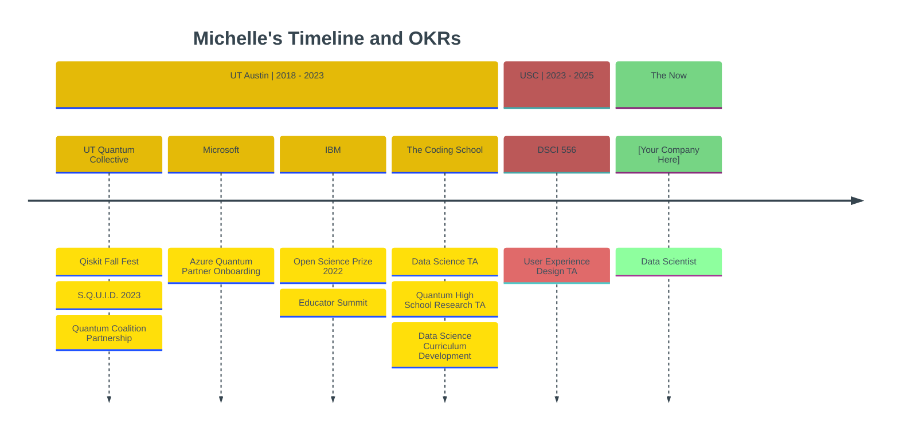

```mermaid

--- 
config:
 theme: 'base' 
 themeVariables: 
   primaryColor: '#FAE072'
   primaryTextColor: '#36454F'
   secondaryColor: '#E0B3B3'
   tertiaryColor: '#D8F3DC'
   
---
timeline
    title Michelle's Timeline and OKRs
    section UT Austin | 2018 - 2023
        UT Quantum Collective 
        : Qiskit Fall Fest
		: S.Q.U.I.D. 2023
		: Quantum Coalition Partnership
        Microsoft
        : Azure Quantum Partner Onboarding
        IBM
        : Open Science Prize 2022
        : Educator Summit
        The Coding School 
        : Data Science TA
        : Quantum High School Research TA
        : Data Science Curriculum Development 
        
    section USC | 2023 - 2025
        DSCI 556 : User Experience Design TA
	section The Now
		[Your Company Here]
		: Data Scientist
		

```

^c1232c

